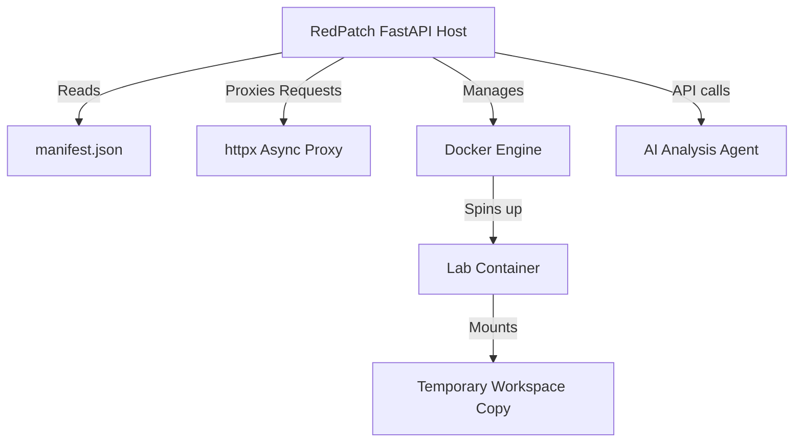

# RedPatch

An interactive, containerized learning playground for web application security, built as a final project for **Harvard CS50x**.

RedPatch enables developers and security enthusiasts to practice offensive security (finding flags) and defensive engineering (writing patches) in isolated Docker containers, supported by an on-demand AI analysis assistant.

---

## 🚀 One-Click Quick Start (Docker)

Get up and running immediately using Docker Compose. Make sure Docker is running on your machine, then run:

```bash
docker-compose up --build
```

Access the platform at: [http://localhost:8000](http://localhost:8000)

---

## 🎮 Game Modes

RedPatch features two primary interactive modes:

### 1. 🕵️‍♂️ Pentester Mode (Offensive)
- **Objective:** Find the vulnerability in the proxied web app, exploit it, and retrieve the hidden flag.
- **Verification:** Submit the flag (format: `redpatch{...}`) inside the Workspace to verify your successful hack.

### 2. 💻 Coder Mode (Defensive)
- **Objective:** Fix the underlying vulnerability.
- **Workflow:** Use the built-in IDE editor in the Workspace to patch the source code.
- **Verification:** Trigger the **AI Analysis** agent to verify if your code change securely remediates the vulnerability.

---

## 🏛 Architecture Overview

RedPatch uses a decoupled, manifest-driven architecture:



- **FastAPI Host (`app/main.py`):** Acts as the orchestrator, serving the dashboard, file workspace, proxy endpoints, and handling API communication.
- **Manifest Catalog (`app/labs/manifest.json`):** A centralized index registry defining available security modules, image tags, internal ports, and download URLs.
- **Lab Container Isolation:** Each lab runs in a separate Docker container. Its source directory is extracted and bind-mounted as a session-specific workspace to support safe on-the-fly patching.
- **AI Agent (`app/services/ai/ai_agent.py`):** Leverages an LLM provider to evaluate user code patches and provide actionable vulnerability remediation advice.

---

## 🛠 Getting Started (Local Development)

If you wish to run the host service locally outside Docker:

### Prerequisites
- Python 3.10+
- Docker Desktop (must be running)

### Installation
1. Clone the repository and navigate to the root directory.
2. Setup and activate a virtual environment:
   ```bash
   python -m venv .venv
   # Windows:
   .venv\Scripts\activate
   # Linux/macOS:
   source .venv/bin/activate
   ```
3. Install dependencies:
   ```bash
   pip install -r requirements.txt
   ```
4. Create a `.env` file in the root directory and add your API keys:
   ```env
   API_KEY=your_gemini_or_openai_api_key
   ```
5. Start the FastAPI development server:
   ```bash
   uvicorn app.main:app --reload
   ```

---

## 📚 Documentation
For detailed guides on how to interact with the platform or how to develop/publish your own labs, check out:
- [Contributing Guide](CONTRIBUTING.md)
- [FAQ](FAQ.md)
- [Security Policy](SECURITY.md)
- Or visit the `/documentation/contributing` endpoint on your running instance.
