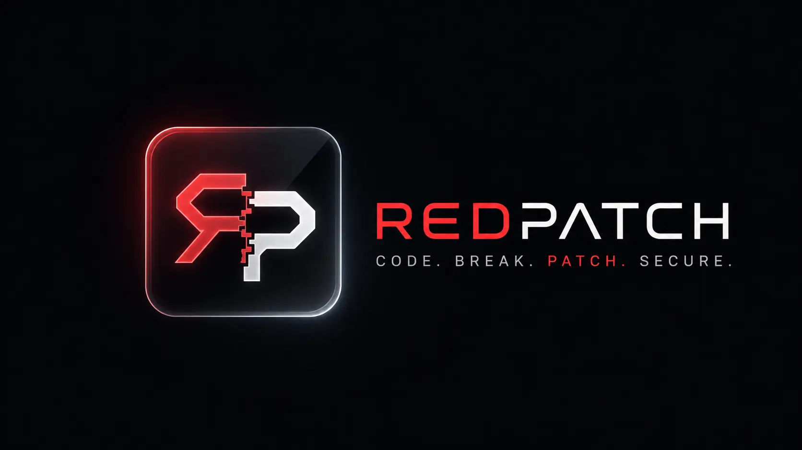
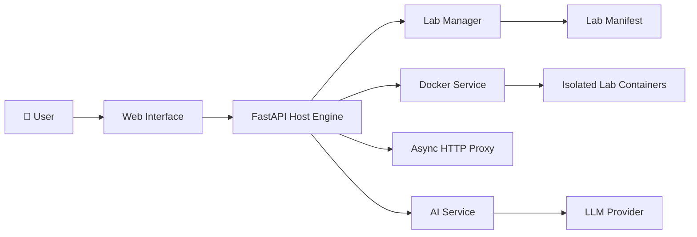

<div align="center">



<br><br>

# RedPatch

**Interactive Application Security Playground & Defense Simulator**

Exploit vulnerable applications. Patch the source. Verify the fix.

All through one isolated, containerized security workflow.

<br>

<a href="https://github.com/msalihberk/redpatch">
  
</a>
<a href="https://hub.docker.com/r/msalihberk/redpatch">
  
</a>
<a href="https://github.com/msalihberk/redpatch-labs">
  
</a>
<a href="https://github.com/msalihberk/redpatch/blob/main/LICENSE">
  
</a>

<br><br>

<a href="#-how-redpatch-works">How it works</a> · <a href="#-architecture">Architecture</a> · <a href="#-labs">Labs</a> · <a href="#-quick-start">Quick Start</a>

</div>

---

<div align="center">

### One vulnerability. Two perspectives. One complete security workflow.

<br>

**🕵️ EXPLOIT**   →   **💻 PATCH**   →   **🤖 VERIFY**

</div>

---

## ⚡ What makes RedPatch different?

Most security training environments teach you to **find** a vulnerability.

RedPatch makes you go one step further:

> **Exploit it → understand it → fix it → verify the fix.**

The platform combines offensive security practice with defensive code remediation inside disposable Docker-based environments.

No separate tools.
No disconnected exercises.
One continuous workflow.

---

## 🎯 How RedPatch Works

```text
┌─────────────────────────────────────────────────────────────────┐
│                         REDPATCH                                │
│                                                                 │
│   🕵️ PENTESTER          💻 CODER            🤖 AI AGENT         │
│   ─────────────          ────────            ──────────         │
│   Find the flaw    →     Patch it      →     Verify it          │
│   Exploit the app        Modify code         Analyze fix        │
│                                                                 │
└─────────────────────────────────────────────────────────────────┘
```

### 🕵️ Pentester Mode

Interact with an intentionally vulnerable application and investigate its attack surface.

Find the vulnerability, exploit it and retrieve the lab's flag.

### 💻 Coder Mode

Move from attacker to defender.

The vulnerable application's source becomes available through the built-in workspace, allowing you to inspect and patch the underlying code.

### 🤖 AI Verification

Submit your remediation to the configured security analysis agent.

The agent evaluates the patch and provides feedback on whether the vulnerability has actually been addressed.

---

# 🏗️ Architecture

RedPatch is built as a lightweight **host orchestration engine** rather than a collection of hardcoded labs.



The important architectural boundary is:

```text
                    REDPATCH
                 HOST ENGINE
                      │
       ┌──────────────┼──────────────┐
       │              │              │
       ▼              ▼              ▼
   Lab Manager     Docker          AI Service
       │              │              │
       ▼              ▼              ▼
   Manifest       Lab Runtime     LLM Provider
```

### Host Engine

`app/main.py` is the central application entry point.

It coordinates the web interface, lab lifecycle, workspace operations and request routing.

### Lab Manager

`app/services/module_manager/lab_manager.py` handles the lab catalog and manifest.

The engine does not contain the implementation of every vulnerability lab.

Instead, it consumes metadata describing available laboratories.

### Container Service

`app/services/container_services/` isolates Docker-specific lifecycle operations from the rest of the application.

### AI Service

`app/services/ai/` provides the AI analysis layer and separates provider-specific logic from the host engine.

---

# 🧩 Labs

**The labs are maintained separately from the RedPatch engine.**

This repository contains the **platform and orchestration layer**.

The actual vulnerable applications and laboratory implementations live in:

<div align="center">

<a href="https://github.com/msalihberk/redpatch-labs">


</a>

<br><br>

**github.com/msalihberk/redpatch-labs**

</div>

The host engine discovers available laboratories through `app/labs/manifest.json`.

A simplified entry looks like:

```json
{
  "labs": {
    "SQLi": {
      "description": "SQL Injection",
      "submodules": [
        {
          "id": "sqli-0",
          "title": "SQL Injection - Authentication Bypass",
          "category": "web",
          "image_tag": "redpatch-lab/sqli-0:v1.0.0",
          "port": 5000,
          "dev_path": "./labs/sqli-0",
          "download_url": "..."
        }
      ]
    }
  }
}
```

The manifest acts as the bridge between the **RedPatch engine** and the externally maintained **RedPatch Labs** ecosystem.

### Why separate the labs?

This separation keeps the platform modular:

```text
redpatch
│
└── Host / Orchestration
        │
        └── manifest.json
                 │
                 ▼
          redpatch-labs
                 │
        ┌────────┼────────┐
        ▼        ▼        ▼
      SQLi     IDOR     Command Injection
```

The engine manages **how labs run**.

The labs repository defines **what the labs are**.

---

# 🔐 Containerized Execution

When a laboratory starts, RedPatch handles the runtime lifecycle through Docker.

```text
Manifest
   │
   ▼
Lab Selection
   │
   ▼
Container Creation
   │
   ▼
Workspace Preparation
   │
   ▼
Interactive Session
   │
   ▼
Teardown
```

This gives each active laboratory its own containerized runtime while keeping the orchestration logic inside the host engine.

> RedPatch is an educational security playground. Its isolation model should not be treated as a hardened production sandbox for arbitrary hostile workloads.

---

# 🤖 AI Security Layer

The AI service is intentionally separated behind a provider abstraction.

```text
                 AI Agent
                    │
                    ▼
             Provider Interface
                    │
                    ▼
             Gemini Provider
```

This means the rest of RedPatch does not need to depend directly on provider-specific API implementation.

The current configuration supports Google Gemini.

```json
{
  "API_KEY": "your_gemini_api_key_here",
  "LLM_PROVIDER": "gemini",
  "MODEL": "gemini-flash-lite-latest"
}
```

Configuration:

```text
app/core/config.json
```

or through:

```env
CONFIG_JSON=app/core/config.json
```

---

# ⚡ Quick Start

### Docker

```bash
docker network create redpatch_net
docker volume create redpatch_lab_tmp

docker run -d \
  --name redpatch-app \
  -p 8000:8000 \
  -v /var/run/docker.sock:/var/run/docker.sock \
  -v redpatch_lab_tmp:/app/labs/archives \
  --network redpatch_net \
  msalihberk/redpatch:latest
```

Then open:

**http://localhost:8000**

### Docker Compose

```bash
git clone https://github.com/msalihberk/redpatch.git
cd redpatch

docker compose up -d --build
```

Open **http://localhost:8000**.

---

# 🛠️ Development

### Requirements

* Python 3.10+
* Docker / Docker Desktop
* Git

```bash
git clone https://github.com/msalihberk/redpatch.git
cd redpatch

python -m venv .venv
```

Activate:

```bash
# Linux / macOS
source .venv/bin/activate

# Windows
.venv\Scripts\activate
```

Install:

```bash
pip install -r requirements.txt
```

Run:

```bash
uvicorn app.main:app --reload --port 8000
```

---

# 📁 Project Structure

```text
redpatch/
├── app/
│   ├── main.py
│   │
│   ├── core/
│   │   ├── config.py
│   │   └── config.json
│   │
│   ├── labs/
│   │   └── manifest.json
│   │
│   ├── services/
│   │   ├── ai/
│   │   ├── container_services/
│   │   └── module_manager/
│   │
│   ├── static/
│   └── templates/
│
├── docker-compose.yaml
├── requirements.txt
├── CONTRIBUTING.md
├── SECURITY.md
└── LICENSE
```

The source tree follows the same separation as the runtime architecture:

**Interface → Engine → Services → External Labs**

---

# 🗺️ Roadmap

* [x] Containerized lab execution
* [x] Pentester Mode
* [x] Coder Mode
* [x] Manifest-driven lab discovery
* [x] Isolated workspaces
* [x] AI-assisted verification
* [x] Docker distribution
* [ ] More vulnerability categories
* [ ] Additional LLM providers
* [ ] Automated security regression testing
* [ ] Expanded lab ecosystem

---

# 🤝 Contributing

RedPatch is designed to grow through both **engine improvements** and **new security laboratories**.

If you want to contribute:

* Improve the host engine
* Add infrastructure capabilities
* Create new labs in the [`redpatch-labs`](https://github.com/msalihberk/redpatch-labs) repository
* Report bugs
* Suggest new security scenarios

Read the [Contributing Guide](CONTRIBUTING.md) before submitting a pull request.

---

<div align="center">

## ⭐ Like the idea?

### Star the project and follow its evolution.

<br>

<a href="https://github.com/msalihberk/redpatch">

</a>

<br><br>

<sub>

Built with ❤️ as a Harvard CS50x Final Project by <a href="https://github.com/msalihberk">Mustafa Salih Berk</a>.

</sub>

</div>
